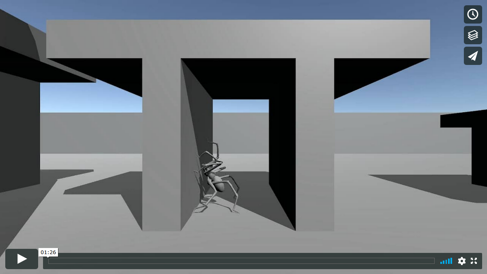

## Unity-Procedural-IK-Wall-Walking-Spider
A Unity Engine Project in which a controllable wall-walking spider uses inverse kinematics (IK) to position its legs to its surroundings in a smart fashion, such that is moves realistically.
The user can freely control the spider, which is able to walk on any surface: walls, corners, ceilings, ... you name it!
While moving, the legs dynamically position themselves to the surroundings without the use of any animations, that is all the movement is procedural.

## Motivation
Back when i was developing a game i created a spider which was able to walk on any surface. It was exciting to see the spider walk on, around, over and under any kind of object such as tables, chairs, lamps, food items etc.
However, since the thrill of controlling such a spider is to experience the world through its eyes and its scale it seemed very important for it to have very precise movement instead of the pre set animations it had at the time.
Controlling a spider, or any small creature at that, is very different from controlling a human for example, in that the player is already enticed by the very movement of the spider.
For example, walking over a banana or a spoon can already feel exciting and fun for the player. And this could only be realized using some kind of dynamic movement using information gathered from the surroundings in realtime.
As i done more research i stumpled upon inverse kinematics. However, the task isn't done by simply implementing such an algorithm.
The algorithm only solves for a position given a target position.
But how do i calculate the target position? When do i have to update it? There is a bunch of information needed to answer these questions, such as the topology of the surroundings, the movement of the spider, asynchronity to other legs, the degrees of freedom the joints of the legs have etc.
Implementing an IK system together with a smart system of calculating and predicting target positions gave me the procedural animation i wanted.

## Showcase

## Features
There are a lot of IK systems out there. However, this projects goal isn't an implementation of a lot of fancy IK algorithms.
The project uses a simple, yet tailored, CCD (Cyclic Coordinate Descent) algorithm.
The main focus of this project is to feed the IK algorithm the right smart targets, configured and fine tuned for the spider such that it moves realistically without the use of any kind of animation.

## How to use?
1. Create a new Unity project
2. Drag and drop the files into your Unity project.
3. Open the scene "Main Spider IK Test Scene" 
4. Press play and enjoy

## Credits
Special thanks to [Daniel Harrison](http://www.harrisondaniel.com/) for creating the spider model used in this project.

MIT © Philipp Schofield
